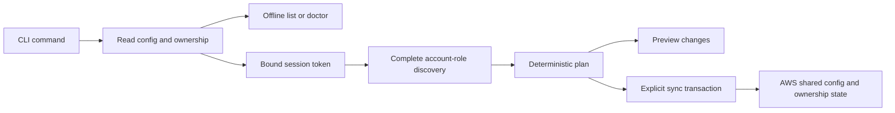

# Architecture and design

AWS SSO Profile Sync turns the account and role assignments visible through IAM Identity Center into AWS shared-config profiles. It handles discovery, naming and configuration updates so that adding another account does not mean hand-writing another profile block.

The original tool has been used daily across more than 50 AWS accounts. This rewrite separates authentication, discovery, planning and file updates, with particular attention to preserving existing configuration. The rewrite has been tested with synthetic accounts and device authorization through Floci; its real AWS and AWS CLI compatibility still requires [manual acceptance](manual-aws-acceptance.md).

## One process, clear boundaries

The program is a Go CLI. Each invocation performs the requested operation and exits. It has no background service, GUI or AWS CLI dependency.

Both the repository root and `cmd/aws-sso-profile-sync` delegate to the same CLI coordinator. The root entry point supports `go install .`; the command directory provides the conventional Go layout. Business logic lives in `internal/` packages:

| Package | Responsibility |
| --- | --- |
| `domain` | Shared session, assignment, profile, result and error types; no tokens |
| `cli` | Arguments, command flow, deadlines, browser notification and table/JSON output |
| `awsclient` | Explicit AWS SDK configuration, bounded retries and isolated emulator transport |
| `auth` | Device authorization, explicit refresh and secure session-bound token storage |
| `discovery` | Complete, paginated account-role discovery with bounded concurrency |
| `planner` | Deterministic names, role selection and ownership-aware proposed changes |
| `configstore` | Strict parsing, byte-preserving rendering, ownership state and recoverable writes |

The planner takes ordinary data and returns a plan. It does not call AWS or write files. Authentication and discovery accept small client interfaces, so tests can exercise failure paths without cloud access. The CLI composes these pieces rather than giving each package its own command-line or environment configuration.

`login` takes a separate path through explicit device authorization. `discover` stops after discovery. `plan` stops at the preview. `sync` computes a fresh plan and then applies it. A saved JSON plan is a review artifact, not an input that can later be applied.

## Authentication is an explicit action

Only `login` can register an OIDC client, start device authorization, refresh a token or save authentication state. Other network commands read an existing valid token; missing or expired authentication returns `login_required`. Previewing configuration cannot unexpectedly open a browser or change a token cache.

The token store binds each cache entry to four values: named session, normalized tenant start URL, SSO region and endpoint. Its filename is a hash of that binding. This keeps sessions and emulator tokens separate without putting the tenant URL in a filename. The configured profile region is independent of the SSO region and does not identify an authentication session.

Tokens are kept beneath `<state-dir>/auth`. The directory and files have owner-only permissions. Reads reject insecure permissions, malformed JSON, unexpected fields, symlink escapes and mismatched bindings. Writes use a temporary file, sync it and atomically replace the cache entry. Token values and client secrets stay out of normal results and error messages.

Explicit login first validates a usable cached token through discovery. It can refresh an expired token when registration and refresh credentials remain valid. A revoked bearer or failed refresh can lead to a new device flow; malformed or insecure cache state is reported rather than silently replaced. Newly issued and refreshed tokens must pass discovery validation before they are saved.

Device polling respects the server interval and increases it for a slow-down response. Cancellation, device expiry, a finite attempt budget and invocation deadlines prevent an indefinite wait.

The tool deliberately uses its own cache instead of choosing an AWS CLI cache file by timestamp. That avoids selecting another session's token, but it also means generating an AWS profile does not establish that the AWS CLI can authenticate with it. Cache interoperability remains a separate manual acceptance check.

## Discovery must finish before planning

SDK clients are built explicitly. They do not load default AWS configuration, credential chains, instance metadata or inherited endpoint overrides. Identity Center calls use the explicit SSO region and the session's bearer token.

Discovery paginates both accounts and roles, removes duplicate account IDs and role names, and sorts the final assignments by account ID and role. The CLI uses four workers for role lookups. SDK requests have a 20-second HTTP timeout and at most three attempts; discovery has a two-minute deadline. Repeated pagination tokens and excessive page counts are errors.

A failed page or account lookup fails the whole discovery operation. No partial assignment list reaches the planner. This matters because an incomplete response could otherwise make valid profiles appear stale or produce a misleading successful sync. The tradeoff is that a transient failure in one account requires retrying the command after the error is resolved.

Development endpoints require an isolated disposable HOME, explicit paths, synthetic credentials and a loopback URL. The transport refuses requests outside that endpoint, including redirects. Floci/Testcontainers tests exercise synthetic Identity Store users, groups, permission sets, assignments and device authorization; those emulator checks do not replace real AWS acceptance.

## Names and ownership remain stable

A profile's identity consists of tenant URL, SSO region, account ID and role name. Ownership also records its named session. New names combine a sanitized account label, account ID and a short identity hash. A role-derived or custom prefix makes names readable; the ID and suffix distinguish accounts with the same label and different roles.

Once a managed identity has a name, later plans reuse that name. Changing a prefix or an account label does not rename an existing managed profile. This favors stable references in scripts and shell commands over automatically refreshing every display label.

Role selection is explicit when discovery finds multiple distinct roles. If exactly one role is available, it is selected with an explanation. Repeating `--role` selects several exact assigned roles.

The ownership manifest authorizes updates to profiles the tool previously created. An existing unmanaged profile with a conflicting name is preserved and reported as a conflict. External changes to managed identity/settings, removal of a managed profile, or reuse of a session name for a different tenant/SSO region also block an update. There is no automatic adoption command.

Assignments that disappear from a complete discovery are reported as `stale`, and their profiles are retained. Selecting fewer roles does not by itself make another visible assignment stale. The tool never interprets missing access as permission to delete local configuration.

## Configuration writes are recoverable

The parser rejects malformed or ambiguous configuration instead of rebuilding it from a partial interpretation. Rendering changes only the intended keys and sections while retaining unrelated settings, comments, ordering and line endings. An unchanged sync preserves config bytes and its modification time.

For a configuration file named `CONFIG`, the tool keeps these adjacent files:

| File | Purpose |
| --- | --- |
| `CONFIG.aws-sso-sync.json` | Versioned ownership manifest |
| `CONFIG.aws-sso-sync.intent` | Pending transaction's before/after hashes and ownership |
| `CONFIG.aws-sso-sync.lock` | Stable advisory-lock file for cooperating writers |

An explicit sync acquires the lock, rechecks the configuration and ownership against its snapshot, and verifies that every proposed profile update is authorized. It then persists the recovery intent, writes a temporary configuration file in the same directory, syncs it, checks again for an external edit, and renames it into place. Readback must match before the ownership manifest is committed and the intent is removed. Existing modes and group ownership are preserved; replacement is refused when the file belongs to another user.

Two files cannot be renamed as one filesystem transaction. The recovery intent bridges that gap: it records whether the config still matches the old state or has reached the intended new state. Read-only commands can interpret a recognized intent in memory; only a later explicit sync reconciles it on disk. If neither hash matches, the tool stops for inspection.

The lock coordinates this tool's writers. Other editors do not participate, so digest checks also detect visible edits before replacement; this is not a universal lock on all software editing the file. An error after replacement can mean the config changed while ownership recovery remains pending. Keep the config and metadata together when backing up or restoring them, and use [offline diagnostics and recovery guidance](usage.md#diagnose-a-problem) before retrying an uncertain write.

## Output is useful to people and scripts

Table output presents profile status and key-level before/after changes without color. JSON emits a schema-version-1 envelope on stdout, while progress and errors go to stderr. Plans include proposed section values, a structured diff and configuration hashes. Typed errors and nonzero exit codes let a script distinguish login, selection, conflict, timeout and incomplete-discovery failures without parsing service response bodies.

See the [usage walkthrough](usage.md) for the command sequence and [development guide](development.md) for the automated checks.
